# 第二章

## 两观，两原理

#### 哲学基本问题

- 1. **物质&意识 第一性**
     
     - 唯物主义（朴素唯物主义，机械/形而上学唯物主义，辩证唯物主义）
     - 唯心主义（主观唯心主义，客观唯心主义）
     
  2. **物质&意识 同一性**
     
     可知论 ：有同一性 （意识可以认识物质）
     
     不可知论 （意识不可以/不能完全认识物质）
     
  3. **物质间存在关系 **
     
     - 辩证法唯物主义：联系、发展 （夸大运动）
   - 形而上学唯物主义：孤立、静止 （夸大静止）
  
  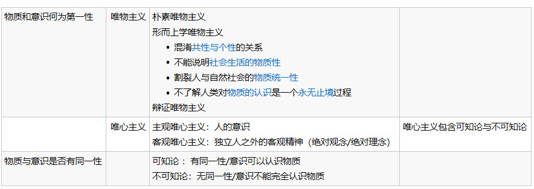

#### 物质

1.  物质唯一特性：客观实在性
2. **物质观理论意义：**
   - 把唯物主义一元论 & 唯心主义一元论、二元论划清界限
   - 坚持了可知论 和 反映论，批判不可知论
   - 唯物论 & 辩证法 的统一
   - 唯物主义自然观 & 唯物主义历史观 统一 
3. **物质与运动：**
   - 物质根本属性: 运动（考法：不是 唯一属性）
   
   - 物质存在方式: 运动
   
   - 物质和运动不可分割
   
     - 形而上学：物质是静止的
     - 唯心主义：运动是意识的/无物质的运动
   
4. **运动与静止**
   - 绝对运动 & 相对静止的辨证统一
     - 区别：
       - 运动——绝对性、无条件性
       - 静止——相对性、有条件性
     - 联系：
       - 相互依赖、渗透、包含
       - 动中有静、静中有动
5. **运动与时空：**
   - 物质运动存在形式：时、空
   - 关系：运动 & 时空  不可分割
   - 时空特点：
     - 客观性
     - 绝对性（绝对存在）
     - 相对性 
     - 有限性（具体事物）
     - 无限性  (所有事物）
6. **实践：**
   - 意义：
     - 自然存在 & 社会存在 基础
     - 社会生活的本质：实践
     - 实践是“物质世界 分为 自然界 和 人类社会 ” 的历史前提，又是 两者统一的 现实基础
   - 社会生活的实践性 体现：
     - 实践是社会关系形成的基础
     - 实践形成了社会生活的基本领域
     - 实践构成了社会发展的动力

####  物质与意识的辨证关系

1. **意识定义**
   
   - 物质世界长期发展产物
   - 人脑的机能和属性（人脑是意识的器官，但不是意识的源泉）
   - 客观世界的主观映象
   
2. **意识起源：**

   - 自然界发展产物
   - 社会历史发展产物

3. 意识决定性因素：实践/劳动

   意识影响因素：语言

4. **意识本质：**

   内容是客观的，形式是主观的（客观世界的主观映像，客观内容和主观形式的统一 ）

5. **物质和意识的辩证关系：**

   - 区别：
     - 物质是本原，意识是派生
     - 物质不是意识，意识不是物质
     - 物质不能代替意识，意识不能代替物质
   - 联系
     - 物质可以转化成意识，意识可以转化成物质 （相互转化）
     - 意识依赖于物质，但又有相对独立性（意识的依赖性和相对独立性）
     - 物质决定意识，意识反作用于物质

6. 意识对物质的反作用（意识能动作用）

   - 意识活动有目的性和计划性 （实践围绕意识）
   - 意识活动有创造性
   - 意识具有指导实践、改造客观世界的作用
   - 意识调控人的行为和生理活动

7. **主观能动性和客观规律性的统一**

   - 尊重客观规律是正确发挥主观能动性的前提
     - 从实际出发
     - 发挥主观能动性的基本途径：实践
     - 主观能动性的发挥依赖于：物质条件+物质手段
   - 充分发挥主观能动性才能正确认识和利用客观规律
   - 实践是两者统一基础

#### 物质的统一性

1. **表现：**

   - 意识统一于物质（意识起源于物质，意识本质是客观存在的主观印象，意识作用要尊重客观规律）
   - 人类社会统一于物质（形而上学没有认识到人类社会统一于物质）
     - 人类社会依赖于自然界，是物质世界的一部分
     - 实践是物质
     - 生产方式体现社会的物质性

2. **意义：**

   - 理论：

     - 马哲唯物主义一元论的基石/前提

   - 实践：

     - 一切从实际出发

       

## 事物联系和发展

#### 联系和发展的普遍性

（唯物辩证法的总观点和总特征）

1. **联系**
   - 定义：
     - 同事物、不同事物 相互影响、相互制约、相互作用关系；
     - 联系以区别为前提
   - 特点：
     - 客观性
     - 普遍性
       - 事物内、事务外、整个世界
     - 多样性
     - 条件性
       - 条件作用：支持/制约
       - 条件可以改变（ 不利—> 有利 ）
       - 条件的改变和创造，要尊重客观发展规律
       - 反对无条件论和唯条件论
2. **变化和发展**
   - 运动定义：
     - 一切形式的变化（好方向+坏方向）
   - 运动、变化、发展 ：
     - 物质固有属性: 运动
     - 运动=变化 > 发展
   - 发展：前进、上升的运动，新事物产生和旧事物灭亡
     - 新事物：
       - 新事物&旧事物 与时间无关
       - 新事物是旧事物的改良
       - 新事物符和人民群众利益
     - 发展=过程：世界是过程的集合体
       - 形式：交替
       - 内容：更新

#### 联系和发展的基本环节（五对范畴）

1. **内容与形式：**
   
   - 定义：构成要素 & 表现方式
   - 关系：辩证统一
     - 区别：内容不是形式，形式不是内容
     - 联系：
       - 一定条件下相互转化
       - 形式适合内容时：推动作用；形式不适合内容时：阻碍作用
   - 方法论：重视内容，反对形式主义；创新形式，抛弃与内容不相应的形式
   
2. ​	**本质与现象：**
   - 定义：事物内在联系和外在表现
   - 关系：辩证统一
     - 区别：
       - 现象是事物表面的，本质在事物内部
       - 现象是个别、具体的，本质是一般、普遍的
         - 现象=真象（本质直接、正面的表现）+假象（本质歪曲、颠倒的表现）
         
           【不能用“正/误”形容 真相 & 假象 】
         
         - 假象和错觉：
           
           - 假象（属于现象，客观存在）—>错觉（属于感觉，主观存在）
     - 联系：
       - 本质决定现象
       - 现象表现本质（真象、假象都表现本质）
     - 方法论：
       - 由统一性：通过现象表现一定本质
       - 由对立性：不能停留表面，要透过现象解释本质
   
3. **原因与结果 **

   - 原因与结果都是现象，有先后关系

   - 关系：辨证统一

     - 区别：相互区别的

     - 联系：相互依存、转化

       - 因果不是绝对确定的

       - 因果相互作用

       - 因果相互渗透

       - 因果关系复杂：一因多果，一果多因

         【“有其因必有其果”是错的，可能同因异果】

     - 方法论：“凡事预则立，不预则废”，因果关系的客观普遍性

       【唯心论：因果报应；神学目的论】

4. **必然与偶然**

   - 定义：事物产生、发展、衰亡的不同趋势
     - 必然：事物发展的确定趋势，偶然：不确定趋势
     - 事物发展既有必然方面，也有偶然方面
   - 关系：对立统一：
     - 区别：
       - 产生原因：必然产生事物内部原因，偶然产生于事物外部
       - 表现形式：必然稳定，偶然不稳定
       - 地位作用：必然起决定性作用，偶然起促进延缓作用
     - 联系：
       - 相互依存：必然寓于偶然之中，偶然背后隐藏有必然（注意顺序）
       - 相互转化：一定条件下
     - 方法论：重视必然，把握偶然，抓住事物发展的机遇

5. **现实与可能**

   - 定义：事物过去、现在、将来的相互关系

     - 现实：事物综合，可能：发展趋势

     - 区分：

       - 可能性&不可能性(有无依据)
        - 现实可能性&抽象可能性(现实依据充分)
       - 好的可能性&坏的可能性(对人是否有利)
     
     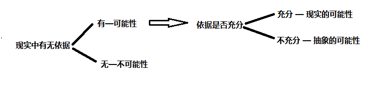
     
   - 关系：对立统一
   
     - 区别：现实是当下客观存在，事物当前状况；可能是事物潜在趋势，事物发展方向
     - 联系：
       - 一定条件下相互转化
       - 现实蕴藏未来发展方向，可能包含发展成为现实的因素和根据
     
   - 方法论：立足现实展望未来，分析可能，发挥主观能动，做好应对不利情况的准备，争取好的可能

#### 对立统一规律是事物发展的根本规律（三大规律）

(唯物辩证法的 核心和实质)

1. 唯物辩证法实质和核心
   - 原因：
     - 对立统一规律揭示了事物普遍联系的根本内容和变化发展的内在动力，根本上回答为何会发展的问题
     - 对立统一规律是其他规律和范畴的中心线索
     - 对立统一规律提供了根本方法——矛盾分析法
     - 是否承认对立统一学说，是唯物辩证法和形而上学对立的实质
   
2. 矛盾的同一性和斗争性及其在发展中作用
- 同一性：双方相互依存、融会贯通
   - 斗争性：相互排斥、相互分离
   - 关系：对立统一
     - 区别：矛盾的斗争性是无条件的、绝对的，矛盾的同一性是有条件的、相对的
     - 联系：
       - 同一性和斗争性相互联结、相辅相成
       - 同一性不能脱离斗争性而存在，<u>斗争性</u>是同一性的<u>前提</u>
       - 斗争性不能脱离同一性而存在，<u>斗争性寓于同一性</u>中，没有同一性就没有斗争性
   - 作用：
     - 同一性作用：
       - 矛盾双方利用对方的发展使自己获得发展
       - 矛盾双方相互吸取有利于自身的因素，在相互作用中各自得到发展
       - 矛盾双方向着自己对立面转化而发展，并规定者事物发展方向。
     - 斗争性作用：
       - 矛盾双方斗争促进双方力量的变化，造成事物的<u>量变</u>
       - 矛盾双方斗争促使双发地位和性质发生变化，实现事物的<u>质变</u>
   - 方法论：
     - 事物发展不仅表现为“相反相成”，且为“相辅相成”，从对立把握同一，从同一把握对立
     - 正确把握和谐对事物的发展（“和谐”不是无差别的一致）
   
3. 矛盾普遍性和特殊性以及相互关系
- 共性与个性、普遍和特殊、一般与个别
   - 普遍性：矛盾无处不在，存在于一切事物中
   - 特殊性：具体事物的矛盾及每个矛盾各个方面在发展的不同阶段各有特点
     - 具体表现：
       - 不同事物的矛盾各有特点
       - 同一事物矛盾在不同发展过程和阶段各有特点
       - 构成事物的诸多矛盾及每一矛盾的不同方面有不同性质、地位和作用（矛盾力量不平衡性）
         - 主要矛盾——支配地位，次要矛盾——从属地位
         - 矛盾主要方面——每一对矛盾中支配地位方，矛盾的次要方面——被支配一方
         - 事物的性质是主要矛盾的主要方面决定的
   - 关系：
     - 区别：矛盾共性是无条件的、绝对的，矛盾个性是有条件的、相对的
     - 联系：任何事物都是共性和个性的统一，<u>共性寓于个性</u>中
- 方法论：具体问题具体分析，对症下药
  
   

#### 量变质变规律（三大规律）

1. 量、质、度：

   - 质:  事物内在规定性（认识质是认识和实践的基础。认识质才能区别事物）
   - 量：可用数量关系表示的规定性（区分质是认识量的前提，考察量是认识质的深化）
     - 量和质是统一的，量和事物的存在不是直接同一的
   - 度:  质和量的统一（物体 超出度则转化为其他物体）

2. 关系：

   - 量变：数量增减/排列次序变动

   - 质变: 事物性质根本变化

   - 量变、质变区分：是否超出度

   - 量变、质变关系：对立统一

     - <u>量变</u>是质变的<u>必要准备</u>

     - <u>质变</u>是量变<u>必然结果</u>

     - 量变质变相互渗透（量变中部分产生质变，质变同时在量变）

       

#### 否定之否定规律（三大规律）

1. 肯定因素: 维持事物存在因素
2. 否定元素：促使现存事物灭亡因素
3. 内容：
   - 否定指事物自我否定
   - 否定是新旧事物联系环节
   - 实质——扬弃
4. 形而上学：肯定一切，否定一切
5. 原理：
   - 事物编制发展为“两否定+三阶段”—— 肯定-否定-否定之否
   - 事物是螺旋上升/波浪式前进
6. 意义：
   - 事物发展是前进性和曲折性的统一

## 唯物辩证法

1. 客观辩证法 &  主观辩证法：

   - 关系：被反映 & 反映（唯物辩证法 & 唯心辨证法 —— 对&错 关系）
   - 唯物辩证法= 客观辩证法（概念辩证法）+主观辩证法
   - 客观辩证法——外部必然的形式； 主管辩证法——观念、逻辑的形式

2. 马克思主义方法论、唯物辩证法、矛盾分析法关系：

   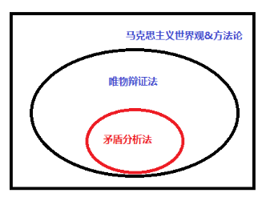

3. 辩证思维方法：归纳演绎，分析综合，抽象具体，逻辑历史统一

# 第三章

## 实践

1. 本质： 
   - 人类能动地改造世界的社会性的<u>物质活动</u>
   - 使物质世界分化为自然界与人类社会的历史前提
   - 自然界与人类社会统一的现实基础，特征: （“现动时”）
2. 特征: （“现动史”）
   - 直接现实性
   - 自觉能动性
   - 社会历史性
3. 三要素：
   - 实践主体
   - 实践客体 （非一切客观事物）
     - 主客体关系：
       - 实践关系（根本）
       - 认识关系
       - 价值关系
     - 主体客体化 ：主体实践作用于客体
     - 客体主体化 :   客体变成主体一部分
   - 实践中介
4. 实践类型：
   - 物质生产实践 （最基本）
   - 社会政治
   - 科学文化
   - 虚拟实践（新增）—— 相对独立性
5. 实践的决定作用：
   
   - 实践是认识的<u>来源</u>（实践决定认识）
   
   - 实践是认识的动力
   
   - 实践是认识的<u>根本目的</u>
   
   - 实践是检验真理的唯一标准
   
     

## 认识

1. 认识的本质：

   - 唯心先验论 & 唯物反映论

   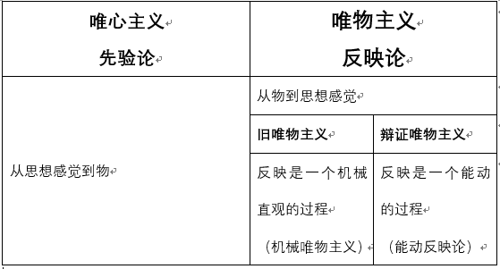

   - 辩证唯物主义/能动反映论 特点： 
     - “实践”引入认识论
     - “辩证法”引入反映论
   - 认识的概念：主体在实践基础上对客体的能动反映
     - 摹写性+创造性 （反映与创造不可分割）

2. 认识过程两次飞跃（第一次飞跃）

   - 感性认识：
     - 对象：事物现象、外部联系、各个方面的认识
     - 形式：感觉、感知、表象
     - 特点：局限性、不深刻
   - 理性认识：
     - 对象：事物本质、内部联系、自身规律
     - 形式：概念、判断、推理
     - 特点：抽象性、间接性
   - 关系：对立统一
     - 区别：（对象、形式、特点三方面）
     - 联系：
       - 感性认识有待于发展成理性认识
       - 理性认识依赖感性认识
       - 相互渗透、相互包含
   - 认识过程中的影响因素：
     - 理性因素：指导、解释、预见作用
     - 感性因素：激活、驱动、控制作用

3. 认识的规律：

   - 反复性（形式）—— “实践—感性认识—理性认识—实践” 
   
   - 无限性 （实质）
   
     

## 真理与价值

1. 真理:

   - 含义：主客观相符合，对客观事物的正确反映
   - 特点：
     - 客观性：（真理的本质属性） —(决定)—>  一元性
       - 真理<u>内容客观，形式主观</u>
       - 检验标准——实践
     - 绝对性：主客观统一的确定性+发展的无限性
       - 真理同谬误有界限
       - 认识的前进就是对发展的物质世界的接近，这是绝对的、无条件的
     - 相对性：认识是有限的+不完善的
       - 认识的广度：认识对象有待扩展
       - 认识的深度：认识正确程度有待深化

2. 真理绝对性 & 相对性 关系： 对立统一

   - 区别：

   - 联系：

     - 相互依存
     - 相互包含：
       - 绝对性寓于相对性
       - 相对性包含绝对性

     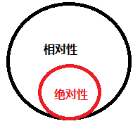

3. 真理发展规律：

   - 真理永远在相对向绝对的永无止境的转化中

4. 真理的绝对性&相对性 根源于 人认识世界的能力的无限性和有限性、绝对性与相对性的矛盾

5. 夸大绝对真理——教条主义，夸大相对真理——诡辩论

6. 真理与谬误:

   - 关系 ：对立统一

     - 区别：主观是否与客观相等？ 是性质不同的两种认识

     - 联系：

       - 一定条件下相互转化
       - 真理和谬误相比较而存在，在批评谬误中发展真理

       （辨析：真理相对性：现在对的，未来可能变错的趋势和特性；谬误：现在就是错的）
       
       

## 真理的检验标准

1. 实践作为真理唯一检验标准原因：
   - 真理的本性：主观和客观的相符合
   - 实践的特点：直接现实性
   
2. 实践检验真理的过程中，逻辑证明起到决定性补充作用：
   
   - 逻辑证明不可做为标准，逻辑证明必须服从实践检验的最后结果
   
3. 实践检验的确定性与不确定性:
   - 确定性：=绝对性。检验真理的标准的唯一性、不可推翻性、当前实践不能判定最终也会被以后的判定
   - 不确定性：=相对性。一定历史阶段的具体实践有局限性；实践检验真理是一个过程，非一次完成；已被检验还需要继续后续实践检验。
   
4. 真理与价值的辩证统一：

   - 价值的特点：

     - 主体性：价值关系的形成依赖于主体的存在，不同主体价值不同
     - 客观性：价值客观存在
     - 多维性：同一客体对不同主体价值不同
     - 社会历史性：历史时期不同，价值不同

   - 价值评价：

     - =价值判断
     - 特点：
       - 评价以主客体的价值关系为认识对象
       - 评价结果<u>受主体意识</u>影响
       - 评价结果的正确与否，依赖于对客体状况和主题需要的认识
       - 价值评价并非一种主管随意的认识活动，而是具有客观性的认识活动
       - 只有与历史发展趋势和人类整体需求利益相一致才是正确的价值评价

   - 实践的真理尺度和价值尺度：

     - 任何成功的实践都是真理尺度和价值尺度的统一

     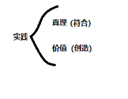

   - 真理和价值在实践中的辩证统一关系：

     - 真理是价值尺度的前提（真理必然有价值）

     - 价值尺度推动人们不断发现真理

       

## 认识世界和改造世界

1. 认识世界和改造世界的过程是从必然走向自由的过程

   - 自由是对必然的认识和对客观世界的改造
     - 自由：能动性；必然：规律
       - 必然和自由是两种社会活动状态
     - 自由的条件：
       - 认识条件：认知越大，自由越大
       - 实践条件：
         - 自由以必然为限度
         - 自由不能牺牲别人的自由

2. 理论创新和实践创新关系：

   - 实践创新是理论创新的动力源泉

   - 理论创新是实践创新的行动指南

   - 两者要良性互动

# 第四章

##  历史观的两个问题

### 社会存在&社会意识

1. ​	历史观的基本问题——社会存在和社会意识的关系

   - 唯物史观：社会存在第一性，社会意识第二性（社会存在决定社会意识）

   - 唯心史观：社会意识第一性
     - 缺点：
       - 重视思想/精神，轻视物质和经济原因
       - 只肯定个人作用，否定群众作用

2. 社会存在：

   - 含义：社会生活的物质方面：自然、人口、生产方式 （生产力+生产关系）

3. 社会意识：

   - 含义：社会存在的反映
   - 作用：鲜明的阶级性（经济上占统治地位阶级的意识形态）
   - 特点：
     - 与社会存在发展的<u>不同步性和不平衡性</u>
     - 社会意识内部 相互影响& 各自有<u>历史继承性</u>
     - 社会意识对社会存在的<u>能动作用</u> (好的促进，坏的阻碍)，通过实践实现

4. 社会存在与社会意识关系：辩证统一

   - 区别：
   - 联系：
     - 社会存在决定社会意识
       - 社会存在是<u>客观来源</u>，社会意识是<u>主观反映</u>
       - 社会意识是社会物质交往的产物
       - 社会意识是具体的、历史的（或早或晚而非立刻地 发生变化和发展）
     - 社会意识有相对独立性（有独特形式和规律）
       - （说明即为 社会意识的特点三条）

## 社会基本矛盾

### 生产力&生产关系

1. 生产力：

   - 含义： 人改造、影响自然解决自然矛盾的实际能力（人与自然）

   - 特点：客观现实性+ 社会历史性

   - 结构组成：
   
  - 劳动资料/劳动手段（生产工具：生产力发展水平的<u>客观尺度</u>，区分物质经济时代的客观依据）
     - 劳动对象
  - 劳动者
   
   - 重要因素：科学技术（第一生产力）

  

2. 生产关系：

   - 含义：人与人之间的客观经济关系
   - 意义：社会关系中最重要的关系
   - 特点：客观性（是物质）、历史性
   - 构成：（广义）
     - 生产资料<u>所有制</u>关系（基本的、决定性的）
       - 区分不同社会/不同生产方式/不同社会经济结构性质的客观依据
     - 生产中<u>人与人</u>的关系
     - 生产中<u>产品分配</u>关系
   - 构成：（狭义）
     - 生产、分配、交换、消费

3. 生产力&生产关系 的关系：不可分割

   - 整体关系：
     - 生产力是物质内容，生产关系是社会形式
     - 生产力+生产关系=生产方式
   - 相互关系：
     - 生产力决定生产关系
     - 生产关系反作用生产力（促进/阻碍）

4. 生产力&生产关系 的矛盾运动规律：

   - 生产关系一定要适合生产力状况（社会发展第一规律）

### 经济基础和上层建筑

1. 经济基础：

   - 含义：社会经济结构，生产关系（生产力决定的）总和

2. 上层建筑：

   - 含义：意识形态（观念上层建筑）+ 制度、组织和设施（政治上层建筑 ）
     -   政治上层建筑是主导地位，国家政权是核心

3. 关系：辩证统一

   - 经济基础决定上层建筑

     - 在上层建筑的产生、性质、变革三方面
     - 上层建筑有依赖性但也有相对独立性

   - 上层建筑反作用于经济基础

     - 取决于上层建筑所服务的经济基础是否利于生产力的发展（社会发展第二规律）

   - 相互影响，相互作用

     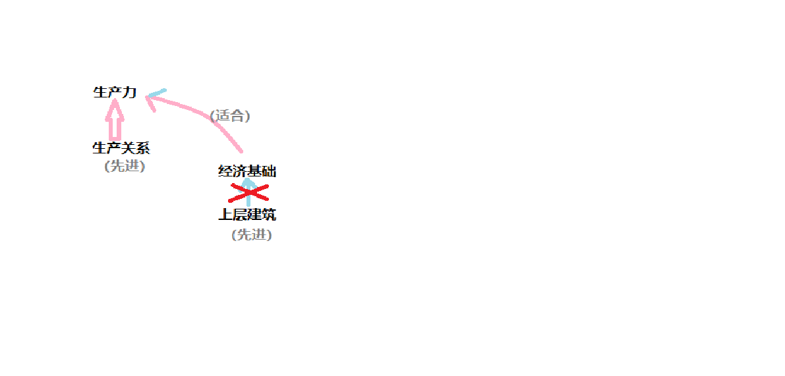

### 社会形态更替

1. 社会形态的含义：
   - 社会形态=经济基础+上层建筑=经济形态+（意识形态+政治形态）
     - 三者统一是：历史的、具体的（具体国家不同）
     - 经济基础是“骨骼”——决定性
     - 上层建筑是“血肉”
2. 更替的特点：
   - 纵向：统一性、多样性	；横向：同类社会形态有共同性质,又有不同特点
   - 更替的必然性，人们的历史选择性
   - 更替的前进性、曲折性

## 社会历史发展动力

### 社会基本矛盾

1. 矛盾内容：生产力/生产关系，经济基础/上层建筑
2. 矛盾作用：
   - 历史发展根本动力
     - 生产力是基本动力因素+决定力量
     - 生产力/生产关系矛盾是根源
     - 社会基本矛盾有不同表现形式和解决方式，影响和促进社会形态的变化和发展

| 内容         | 作用                                                 |
| ------------ | ---------------------------------------------------- |
| 社会基本矛盾 | 社会发展的<u>根本动力</u>                            |
| 阶级斗争     | 社会基本矛盾在阶级社会中的体现 阶级社会发展动力 |
| 社会革命     | 社会形态更替动力之一                                 |
| 改革         | 社会发展动力之一                                     |
| 科学技术革命 | 社会动力体系内容之一                                 |

### 科学技术

1. 作用：社会的发展动力之一
   - 影响生产方式
   - 影响生活方式
   - 影响思维方式

## 人民群众

1. 两种历史观对立：

   - 唯心史观——英雄史观
     - 否认物质资料<u>生产方式</u>对社会发展的决定力量
     - 否认人民群众的历史作用
     - 夸大英雄人物作用
   - 唯物史观——群众史观

2. 唯物史观考察历史创造者的原则*4：

   - 现实的人及<u>人的本质</u>：
     - 人&动物区别角度：人的本质在劳动
     - 人&人区别角度：人的本质在一切<u>社会关系的总和</u>
       - 人的本质是社会属性，非自然属性
   - 整体社会历史过程
   - 社会历史发展必然性（即：是否符合规律）
   - 人与历史的不同层次（类、群体、个体 &历史 ）

3. 人民群众对历史的决定性作用：

   - 人民群众定义：推动社会发展的人们（历史范畴）
     - 最稳定主体：劳动群众
   - 原因：
     - 人群众创造<u>物质</u>财富
     - 人群众创造<u>精神</u>财富
     - 人群众决定<u>社会变革</u>
     - 人群众是 先进生产力&先进文化 的<u>创造主体</u>，又是实现<u>自身利益</u>的根本力量
   - 人民群众与社会历史关系：
     - 受到社会历史条件制约（其中：经济条件根本制约，政治条件、精神条件其次）

4. 方法论：

   - 马克思主义意群众观点（why？因为历史由人民群众创造）
   - 群众路线（why？因为历史由人民群众创造）

5. 关于个人作用：

   - 不能决定历史发展总趋势，但可以与人民群众一起创造历史

# 第五章 资本主义

## (导论)

### 资本主义生产关系的产生与生产方式的形成：

1. 资本主义产生途径：
   - 小商品经济分化
   - 商人和高利贷者转化
2. 资本原始积累途径：
   - 暴力手段剥夺农民土地
   - 暴力手段掠夺货币财富
3. 建立资本主义生产方式途径：
   - 资本主义革命
   - 产业革命

## 商品经济与价值

### 自然经济

与商品经济对应的经济范畴

特征：自给自足

生产目的：使用价值

### 商品经济

1. 目的：交换（本质）
2. 历史条件：社会分工（不同部门）+生产资料和劳动产品有不同所有者（需要交换）

### 商品

1. 因素*2：（商品是两者的统一）
   - 使用价值 
     - 含义：指商品能满足人们需要的某种属性——商品有用性
     - 意义：
       - 人与自然的物质关系
       - 商品的自然属性
       - 一切劳动产品的共有属性 (不论是否为商品，都有使用价值)
       - 使用价值构成社会财富的物质内容
   - 价值（=劳动）
     - 含义：指商品里的人类劳动
     - 意义：
       - 决定商品交换比例
       - 商品的社会属性
       - 价值是交换价值的<u>基础</u>，交换价值是价值的<u>表现形式</u>
       - （交换价值：使用价值之间交换的比例）
       - 本质上体现生产者之间的生产关系
2. 关系：对立统一
   - 不可兼得: 
     - 商品生产者获得 价值，则必须让渡 使用价值
   - 缺一不可: 
     - 作为商品必须同时有 使用价值&价值
     - 使用价值是价值的物质承担着
     - 价值寓于使用价值中

### 具体劳动 & 抽象劳动（劳动二重性）

1. 具体劳动（有用劳动）：

   - 含义：生产使用价值的具体形式的劳动
   - 意义：形成商品<u>使用价值</u>

2. 抽象劳动：

   - 含义：不谈形式的 一般人类劳动——体力+脑力

   - 意义：形成商品<u>价值实体</u>

     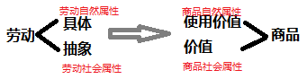

3. 关系：对立统一

   - 区别：
     - 具体劳动 反映 人与自然关系，是劳动<u>自然属性</u>
     - 抽象劳动 反映  生产者的社会关系，是劳动<u>社会属性</u>
   - 联系：
     - 时间&空间上统一

### 商品的价值量

商品价值包括：质的规定 + 量的规定

1. 质的规定：价值实体是什么？（抽象劳动）

2. 量的规定：什么&如何衡量价值大小（社会必要劳动时间） 不是个别劳动时间

   - 社会必要劳动时间：指现有色会正常生产条件下，社会平均的劳动熟练度&劳动强度下，制造某种商品所需劳动时间

3. 商品的价值量&劳动生产率关系：

   - 劳动生产率：劳动者生产<u>使用价值</u> 的能力（效率）

     - 测量：单位劳动时间生产产品数量/单位产品耗费劳动时间

     - | 劳动生产率/效率                            | 时间         | 价值量       |
       | ------------------------------------------ | ------------ | ------------ |
       | $\uparrow$ （反比） | $\downarrow$ | $\downarrow$ |

       其他正向因素：劳动者<u>平均</u>熟练程度，科技，社会结合，生资规模，自然条件

4. 简单劳动&复杂劳动：

   - 简单劳动：不需要经过专门训练
   - 复杂劳动：经过专门训练  = n倍的 简单劳动 
   - 私有制下，复杂劳动 -> 简单劳动 是在商品交换过程中自发实现（市场调控）
   - 形成<u>商品价值量的劳动</u>，以简单劳动为尺度

### 价值形式 & 货币

1. 价值形式的发展历程

   - <u>简单/偶然的</u>价值形式

   - <u>总和的/扩大的</u>价值形式

   - <u>一般的</u>价值形式

   - <u>货币</u>形式

     （后两者形式相同）

     ​	(货币天然是金银，金银天然不是货币)

2. 货币：

   - 本质：长期交换过程中形成的、固定充当一般等价物的、商品

   - 职能*5：

     - 价值尺度（基本）
       - 因为货币本身有价值
       - 价值尺度，只需要观念上的货币
     - 流通手段（基本）：有现货交易，如：买包子
       - 必须是现实的货币，不是观念上的货币
       - 货币可以是不足值的（如：纸币代替货币作为工具执行流通手段）
     - 贮藏手段
       - 足值的货币
     - 支付手段：无现货交易，如：还债
     - 世界货币

   - 意义：

     - 货币形式是价值形式的完成形式

     - 将世界分为两级：具体商品（代表不同使用价值）+货币（代表商品价值）

     - 商品内在使用价值&外在价值的矛盾->外在的商品&货币的矛盾

     - （未解决商品经济的基本矛盾：私人劳动 & 合会劳动）

       

### 价值规律

1. 内容：

   - 商品的价值量=生产商品的社会（平均）必要劳动时间
   - 价值量是商品交换的<u>基础</u>，服从等价交换原则

2. 表现形式：

   - 商品价格围绕商品价值自发波动

   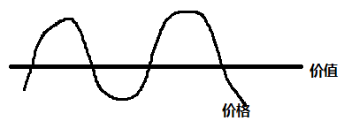

   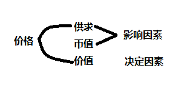

3. 作用：

   - 积极：
     - 自发调节生产资料和劳动力在社会部门间的分配比例
     - 自发刺激生产力发展
     - 自发调节社会收入的分配
   - 消极
     - 导致垄断
     - 商品生产者两极分化
     - 社会资源分配比例失调，导致社会资源浪费

### 私有制下的商品经济矛盾

1. 私有制商品经济矛盾：私人劳动& 社会劳动

2. 发展成资本主义后，该矛盾转化为：生产资料的资本主义私人占有&社会生产化

   （促使 社会主义取代资本主义）

### 马克思劳动价值论（马克思成就）

1. 马克思的成就：
   - 继承古典政治经济学 劳动创造价值 的理论
   - 创立 劳动二重性 理论（“政治经济学枢纽”）
2. 意义：揭示商品经济学一般规律，为社会主义市场经济提供理论指导
3. 当今条件对 劳动价值论的深化：
   - 深化对 创造价值的劳动 的认识，对生产性劳动做出新的界定
   - 深化对 科技人员、经营管理人员在社会生产和价值创造中作用 的认识
   - 深化对 价值创造&价值分配关系 的认识
   - 深化对 科技、知识、信息等新的生产要素在财富和价值创造中的作用 的认识

## 资本主义经济制度

### 劳动力成为商品 

1. 条件：

   （劳动力=体力+脑力）

   - 劳动者是自由人
   - 劳动者没有别的商品来卖

2. 意义：标志 简单商品生产->资本主义商品生产

3. 劳动力商品：

   - 使用价值
     - 特点：
       - 劳动力商品的使用价值是劳动，是价值的源泉
       - 劳力商品在使用中创造新的价值/增值（剩余价值），此时货币变成资本
   
   
   
   - 价值
     - 特点：
       - 劳动力价值=历史因素+道德因素）
     - 包括了：
       - 维持劳动者本人生存所需的生活资料价值
       - …….劳动者家属生存…
       - 劳动者教育&训练的支出费用

### 剩余价值的生产

1. 资本主义生产的绝对规律——生产剩余价值

2. 资本主义生产过程的两重性：劳动过程&价值增值过程的统一

   （即为：物质资料生产 & 剩余价值生产）

3. 剩余价值的实质

   剩余价值率

4. 不变资本&可变资本

5. 必要劳动时间 & 社会必要劳动时间

   ​	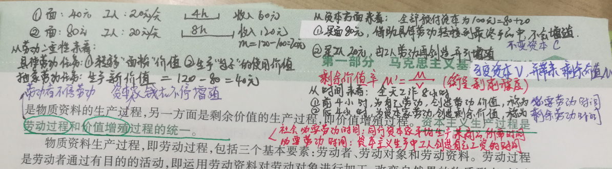

6. 绝对剩余价值 & 相对剩余价值

   - 绝对剩余价值：必要劳动时间不变时，延长工作日长度而生产的剩余价值

   - 相对剩余价值：工作日长不变，缩短必要劳动时间，变相延长剩余劳动时间所产价值

     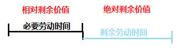

7. 超额剩余价值

   - 某企业率先提高劳动生产率所获得比别人多的剩余价值

8. 生产自动化条件下剩余价值源泉

   - 雇佣工人的剩余劳动力仍是唯一源泉
     - 不存在绝对的“无人
     - 转移了“剥削”

### 资本积累

1. 定义：剩余价值再转化为资本 or 剩余价值的资本化

2. 资本主义简单再生产：生产规模不变

3. 资本主义扩大再生产：剩余价值再投入，扩大生产规模

4. 资本积累：

   - 本质：资本家用无偿占有的工人创造的剩余价值扩大自己资本规模，进一步扩大剥削
   - 源泉：剩余价值
   - 影响规模因素：剥削程度、劳动生产率高低、所用资本和所花费资本差额

   | 辨析：                                                       |
   | ------------------------------------------------------------ |
   | 抽象劳动是价值唯一源泉； 具体劳动是使用价值的源泉（非唯一） |
   | 劳动力商品的使用价值=劳动=剩余价值唯一源泉                   |
   | 剩余价值---(源泉)-->资本积累--(源泉)---> 资本主义扩大再生产  |

5. 资本的有机构成：技术构成决定、反映技术构成变化的、价值构成

   （若不是技术导致的价值构成变化，则该价值构成不是有机构成）

   - 技术构成：技术水平
   - 价值构成（不变资本：可变资本）

6. 相对人口过剩：有机构成提高（价值构成提高），可变资本减少，人工失业

7. 资本积累的历史趋势：资本主义灭往，社会主义

### 资本周转与再生产

1. 流程：

   采购(货币职能) -> 生产(生产资本的职能) ->销售（商品资本的职能）

2. 周转前提

   - 三种职能同空间上并存
   - 三种职能形式时间上继起

3. 资本周转：

   - 定义：资本增值+周而复始地循环
   - 速度因素：
     - 周转时间
     - 固定资本&流动资本构成（流动资本越大，周转速度越快）

4. 社会再生产：

   - 核心问题：价值补偿 + 实物补偿

### 工资与剩余价值的分配

1. 资本主义工资：

   - 本质：劳动力的价值/价格
   - 表现：“劳动力的价格” / 报酬

2. 平均利润：

   - 成本价格 c+v

   - 利润 r=m

   - 平均利润率：行业间竞争形成

     - 平均利润=平均利润率*成本价格
     - 生产价格=成本价格+平均利润
     - 超额利润=超额剩余价值： 同行企业间竞争形成

     一个为业间，一个为业内，故平均利润率的存在 不妨碍 超额利润的形成

3. 平均利润率 & 剩余价值的瓜分：

   - 各类资本家按<u>等量资本</u>获得<u>等量利润</u>原则，瓜分工人创造的资本价值

### 马克思剩余价值理论

1. 马克思哲学上：

   - 创立唯物史观
   - 形成辩证唯物主义

2. 马克思理论上：

   - 创立唯物史观

   - 创立剩余价值学说

     

### 资本主义基本矛盾 & 经济危机

1. 矛盾: 生产资料资本主义私人占有 & 生产社会化
   - 是生产力&生产关系 在资本主义社会的具体体现
2. 资本主义经济危机：
   - 本质特征：生产相对过剩
   - 根本原因：资本主义基本矛盾
     - 表现：
       - 生产扩大 & 劳动人民需求缩小
       - 企业内部有组织性 & 社会生产无政府
3. 经济危机四阶段：危机 ——萧条 ——复苏 ——高涨

## 资本主义政治制度

1. 政治制度：民主
2. 法制：宪法是核心
3. 国家政权：分权制衡
4. 局限性：
   - 金钱操纵，精英统治
   - 法律名义平等，实际不平等
   - 政党制维护 资产阶级
   - 政党斗争激化社会矛盾

## 资本主义意识形态

1. 阶级意识的集中体现
2. 资本主义下的观念上层建筑，为经济基础服务，为政治上层建筑服务

